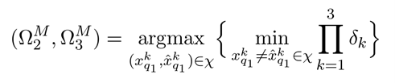

# Three-Transmit-USTLD-Genetic-Algorithm
A genetic algorithm to produce close-to-optimal mapper designs Three Transmit USTLD systems. Recently, a research paper was written based on the genetic algorithm.

The optimization function is given as:

The main aim of the optimization function given above is to maximise the minimum distance between adjacent symbols in δ_2 and δ_3 respectively.

The research paper is currently under review.
